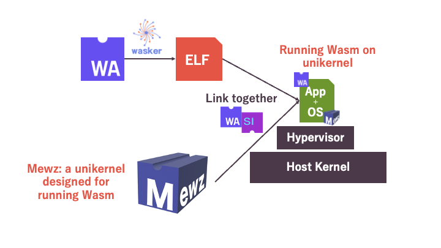
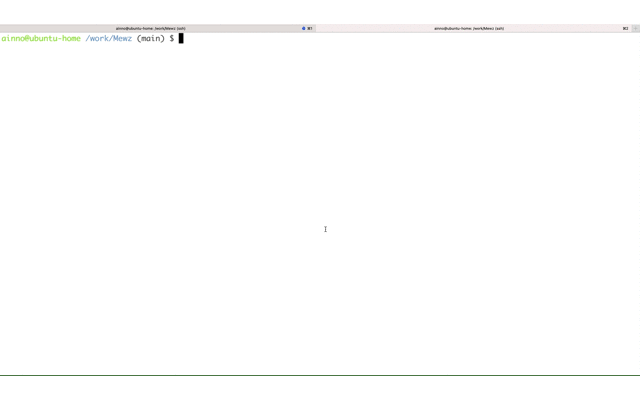

# Mewz


Mewz is a unikernel designed specifically for running Wasm applications and compatible with WASI.

## What's new with Mewz

There are now various Wasm runtimes, but they operate on general-purpose operating systems such as Linux or Windows.

Mewz is **a specialized kernel designed for running Wasm**. Mewz runs a single Wasm application within the kernel by linking it together during the build process with the Wasm application. (A kernel configured in this manner is commonly referred to as a **unikernel**.) In this way, Mewz provides **the minimal required features and environment for executing Wasm**.



## Quick Start

There are some example programs. Please check out [examples](https://github.com/Mewz-project/Mewz/tree/main/examples).

### Option1: Docker

We prepare for a Docker image that has a environment for running Mewz.

```sh
curl -o helloworld.wat https://raw.githubusercontent.com/Mewz-project/Wasker/main/helloworld.wat
docker run -v .:/volume ghcr.io/mewz-project/mewz helloworld.wat
```

This image internally run [Wasker](https://github.com/mewz-project/wasker), build Mewz, and run it on QEMU.



### Option2: Dev Container

You can use Dev Container on GitHub Codespaces or your local VSCode.

To start Codespaces,

- Click Code -> Codespaces -> New codespace on this repository page.
- Wait for a while, then you can see VSCode on browser.
- Open terminal on VSCode

```sh
# On the Dev Container
git submodule update --init
curl -o helloworld.wat https://raw.githubusercontent.com/Mewz-project/Wasker/main/helloworld.wat
wasker helloworld.wat
zig build -Dapp-obj=wasm.o run
```

### Option3: Build from source

Compile a Wasm file into a native object file, using [Wasker](https://github.com/mewz-project/wasker). Follow the instruction [here](https://github.com/mewz-project/wasker#how-to-run-wasker).

Then, build Mewz and run it on QEMU with the following commands.

```sh
zig build -Dapp-obj=<path to the object file generated by Wasker> run
```

To use file systems, specify the directory by `-Ddir=<path to dir>`.

> [!WARNING]
> This option makes an archive of the directory by `tar` and attach it to QEMU.

> [!NOTE]
> QEMU's port 1234 is mapped to localhost:1234.

### Current Status


|        Feature        |                                                Status                                                |
|:---------------------:| :--------------------------------------------------------------------------------------------------: |
|       WASI Preview 1  |                            In Progress: Partial Implementation (Please refer to https://github.com/Mewz-project/Mewz/issues/1)                  |
|       Socket          |                            ✅ (WasmEdge Compatible)                                                   |
|       Component Model |                              Not yet                                                                 |
|       File System     |                            On memory, read only                                                      |
|       Network         |                             ✅                                                                        |
